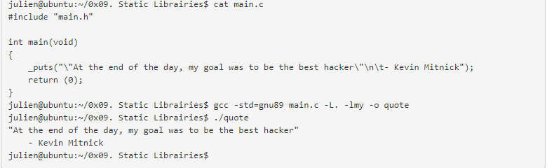
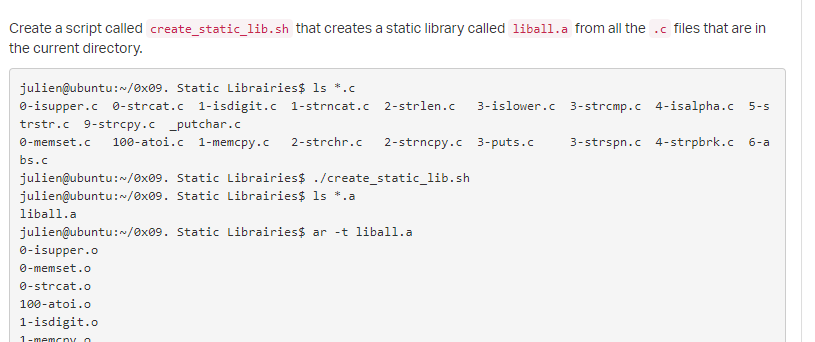
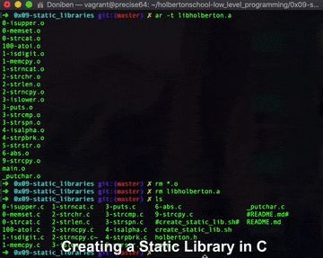

<h1>Static Library </h1>
What is a static library, how does it work, how to create one, and how to use it  
Basic usage of ar, ranlib, nm  
<b>ar</b> is a command used to create a static library from object file  
<b>ranlib</b> Indexing an archive
<ar> and <nm> can be used to list symbols stored in static library
  
  <h3>ar -t libmy.a - list all object files created </h3>
  <h3>  nm libmy.a </h3>
  
  <h2>Usage of static library in main </h2>

  
  <h2>Creating static library from shell script  </h2>

  <h2> Create a static library </h2>
 
